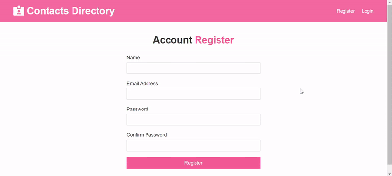
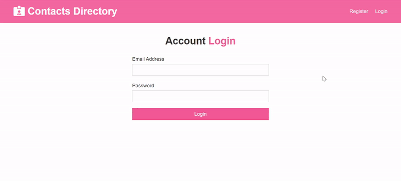

# Contacts-Directory

This is a Contacts Directory where you can login into your Directory using your credentials which will be saved on our database and access your list of contacts.
The backend is built in Node.js with a MongoDB Database to store the data for each contact.

 

The below snippet shows a simple CRUD operation being performed in the Web Application.

 
 
 
 

You can login back to the App anytime to access your saved list of contacts. 
 
 

## Usage
Install dependencies

npm install
npm client-install
Mongo connection setup
Edit your /config/default.json file to include the correct MongoDB URI

## Run Server
npm run dev     # Express & React :3000 & :5000

npm run server  # Express API Only :5000

npm run client  # React Client Only :3000
